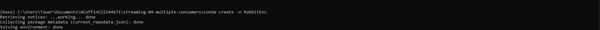

# streaming-04-multiple-consumers
> Executed by: A. C. Coffin | Completed on: May 2024 | NW Missouri State University | CSIS: 44671-80| Dr. Case |
> Use RabbitMQ to distribute tasks to multiple workers

# Overview:
 This project explores the use of multiple Consumers with a single Producer as it handled a csv file. Each of the tasks, is layed out within the file and is to be exicuted by multiple "workers" or consumer scripts that are consuming the producer's output. Unlike the example above these are not filtering through the data, but simply working through the streams. This project contains two sample scripts and thrid custom script designed to output to multiple consumers, utilizing a Round Robin Schedule.
 
 One process will create task messages. Multiple worker processes will share the work. 
 Prior to running this project read [RabbitMQ Tutorial - Work Queues](https://www.rabbitmq.com/tutorials/tutorial-two-python.html) and review the code and comments in this repo.

 ## Round Robin Scheduling
 A Round Robin Schedule is a CPU schedule is an alforithm that peroms a process in a cycle, each process recieves a fixed time (time quantum) before moving onto the next. The CPU in in this instance works in burst that are assigned limits called time quantums. When the CPU recieves a process a time is set for whatever value has been set for a time quantum. Should the process finish before the time quantum timer expires, it is swapped out of the CPU. However, if the timer goes off prior to the process completing, the process in question is swapped out the CPU and pushed to the back of the line. This cycle will continue until all the processes are completed by the CPU. 

 This method addresses several major issues when regarding CPU computations. The first being that alternating between inputs and outputs of some kind is typical of most programs. This allos one process to use the CPU as another waits, making full use of the CPU. Without this it creates an inefficency int he process, where a single process will devour the CPU and we can't complete anything else. The second issue is that we have to balance each of these processes, making an overall system "efficient" and "fair" that can withstand various conditions where these ideas can be subjective (Silberschatz, Gange, Valvin, 2012). We can do this through the use of Round Robinin Schedules, which cna make it looka s though all processes are sharing the CPU equally.
 
 For more on CPU Scheduling read [University of Illinois Chicago, CS 401: Computer Algorithms I: CPU Scheduling](https://www.cs.uic.edu/~jbell/CourseNotes/OperatingSystems/6_CPU_Scheduling.html)
 
## Screenshot

See a running example with at least 3 concurrent process windows here:


Each of the Consumers has numbers corresponding to the row number in the attached tasks.csv. 


# Table of Contents
1. [File List](File_List)
2. [Machine Specs & Terminal Information](Machine_Specs_&_Terminal_Information)
3. [Prerequisites](Prerequisites)
4. [Before you Begin](Before_you_Begin)
5. [Creating Enviroments & Installs](Creating_Enviroments_&_Installs)
    * [Creating VS Code Enviroment](Creating_VS_Code_Enviroment)
    * [Creating Anaconda Enviroment](Creating_Anaconda_Enviroment)
6. [RabbitMQ Admin](RabbitMQ_Admin)
7. [Executing the Code](Executing_the_Code)
8. [Creating v3 Ready for Work](Creating_v3_Ready_for_Work)
    * [8a. Developing the Producer](Developing_the_Producer)
    * [8b. Developing the Consumer](Developing_the_Consumer)
9. [Running v3 Producer/Consumer](Running_v3_Producer/Consumer)
10. [Final Output](Final_Output)
11. [Results](Results)
12. [References](References)

# 1. File List
| Support Files | | | Producer/Consumer Scripts | | | Screen Shots | | |
| ----- | ----- | ----- | ----- | ----- | ----- | ----- | ----- | ----- |
| File Name | Repo Location | Type | File Name | Repo Location | Type | File Name | Repo Location | Type |
| util_about.py | utils folder | python script | v1_emitter_of_tasks.py| main repo | python script | AddingPika1.png | Screenshots folder | PNG |
| util_aboutenv.py | utils folder | python script | v1_listening_wroker.py | main repo | python script | enviromentcondacreateRabbitEnv.png | Screenshots folder | PNG |
| util_logger.py | utils folder | python script | v2_ emitter_of_tasks.py | main repo | python script | packageinstallpika.png | Screenshots folder | PNG |
| aboutenv. txt | util_outputs folder | text | v2_listening_work.py | main repo | python script | runofv1andv2.PNG | Screenshots folder | PNG |
| util_about.txt | util_outputs folder | text | v3_emitter of tasks.py | main repo | python Script | v3Run3Listen1EmHitchhiker.png | Screenshots | PNG |
| v1_emitter_of_tasks.log | logs folder | log | v3_listenin_worker.py | main repo | python script | v3Run3Listen1Emit.png | Screenshots | PNG |
| v1_listening_worker.log | logs folder | log | requirements.txt | main repo | text |
| v3_emitter_of_tasks.log | logs folder | log |  tasks.csv | mainrepo | CSV |
| v3_litenin_worker.log | logs folder | log |

# 2. Machine Specs & Terminal Information
This project was completed using a Windows OS computer with the following specs. These are not required to run this repository. For further details see util_about.txt and aboutenv.txt in the utils_outputs located in the utils folder.

 * Operating System: nt Windows 10
 * System Architecture: 64bit
 * Number of CPUs: 12
 * Machine Type: AMD64
 * Python Version: 3.11.4
 * Python Build Date and Compiler: tags/v3.11.4:d2340ef with Jun  7 2023 05:45:37
 * Python Implementation: CPython
 * Active pip environment:   None
 * Active conda environment: None
 * Terminal Environment:        VS Code
 * Terminal Type:               cmd.exe
 * Preferred command:           python

# 3. Prerequisites
1. Git
2. Python 3.7+ (3.11+ preferred)
3. VS Code Editor
4. VS Code Extension: Python (by Microsoft)
5. RabbitMQ Server Installed and Running Locally
6. Anaconda Installed

# 4. Before you Begin

1. Fork this starter repo into your GitHub.
2. Clone your repo down to your machine.
3. View / Command Palette - then Python: Select Interpreter
4. Select your conda environment. 


# 5. Creating Enviroments & Installs
Befor beginning this project two enviroments were made, one as a VS Code Enviroment and the other as an Anaconda Enviroment. RabbitMQ requires the Pika Library in order to function, to ensure that the scripts exicute create an enviroment in either VS Code or Anaconda.

VS Code Enviroments allow us to create the virtual enviroment within the workspace as a way to isolate python projects with its own pre-installed packages and interpreter. For light projects this is optimal ias VS Code enviroments will not touch other enviroments or python installations. However, pre-installed packages can be limited, and the enviroments will only stay within the folder that is selected. Meaning that you can't simply call in another enviroment. The second method of creating an Anaconda Enviroment is different as it's designed for a heavier work load and is robust. This particular method cereates an specific reusable enviroment with specific Python versiions and pre-installed packages. However, this method can be heavier due to the additional packages.

While the Anaconda Enviroment is not necessary for this project it was utilized to ensure that the enviroments between VS Code and Anaconda were consistant when running the v1 and v2 emitters in VS Code with the v1 and v2 listening scripts running in Anaconda.

## 5a. Creating VS Code Enviroment
To create a local Python virtual enviroment to isolate our project's third-party dependencies from other projects. Use the following commands to create an enviroment, when promted in VS Code set the .venv to a workspace folder and select yes. 

```
python - m venv .venv # Creates a new enviroment
.venv\Scripts\activate # Activates the new enviroment
```

Once the enviroment is created install the following:
```
python -m pip install -r requirements.txt
```
For more information on Pika see the [Pika GitHub](https://github.com/pika/pika)

## 5b. Creating Anaconda Enviroment
To create an Anaconda enviroment open an Anaconda Prompt, the first thing that will pop up is the base. Then we are going to locate our folder, to do this type the following:

```
cd \Dcuments\folder_where_repo_is\ 
cd \Documents\ACoffinCSIS44671\streaming-04-multiple-consumers # This is where the file is located in my computer
```
Once the folder has been located the line should look like this:
```
(base) C:\Users\Documents\folder_where_repo_is\streaming-04-multiple-consumers>
(base) C:\Users\Tower\Documents\ACoffinCSIS44671\streaming-04-multiple-consumers> # My File Path
```

To create an enviroment do the following:
```
conda create -n RabbitEnv # Creates the Enviroment
conda activate RabbitEnv # Activates Enviroment
```
This will create the enviroment, if you want to deactivate it just enter:
`conda deactivate`



Once the enviroment is created exicute the following:

```
python --version # Indicates Python Version Installed
conda config --add channels conda-forge # connects to conda forge
conda config --set channel_priority strict # sets priority
install pika # library installation
```
Be sure to do each of these in order indifidually in order to install pika in the enviroment. You have to use the forge to do this with Anaconda.

   


# 6. RabbitMQ Admin 

RabbitMQ comes with an admin panel. When you run the task emitter, reply y to open it. 

The Admin Panel allows us to manage and monitor nodes and clusters utilized by RabbitMQ. This panel also enables us to use a browser-based UI and command line tool called rabbitmqadmin. Basically this panel periodically collects and agregates system data, each metric is exposed to the human operator, it also provides tools for analyszing memory usage of the node in adition to monitor metrics, uster permission and topology management.

While in the admin pannel it's possible to change Admin Status and add another sign in. It is recomended to remove the "guest" account from the listing of those with the ability to adjust the data stream - especially when creating a stream that's designed to touch other machines. To learn how to adjust Administrators and add accounts read [Management Plugin](https://www.rabbitmq.com/docs/management). This will cover both Command Line methods and throught the Admin Panel that is on IP 127.0.0.1:15672, if you followed the Windows Instalation Setup Wizard. Read through the entirety of this article before making adjustements.

We can also comand Python to open a webpage by using the following method:
```
def offer_rabbitmq_admin_site():
    """Offer to open the RabbitMQ Admin website"""
    ans = input("Would you like to monitor RabbitMQ queues? y or n ") # Gives us the option to continue without opening the admin panel.
    print()
    if ans.lower() == "y":
        webbrowser.open_new("http://localhost:15672/#/queues")
        print()

# call the function defined above
offer_rabbitmq_admin_site()
```

# 7. Executing the Code
Each Producer/Consumer pair is broken into two scripts. The first being the Producer, which generates the work. The second is the Consumer or "Worker" which retrieves the generated work from the queue. When running through the codes remember to have **RabbitMQ running - they will not work if RabbitMQ is off.**

Additionally follow the steps carefully for each of the scripts, as they will dictate which to run and when. This indication is critical when running a single producer with multiple worker scripts. 

**__As a rule of thumb, v1 and v2 scripts were run without multiple workers to ensure that they were in working order.__** 
## 7a. v1 Execute the Producer/Consumer
For v1 you can do each of these in VS Code, the reason being that we are observing the parts of the code in operation and the results.

1. Run emitter_of_tasks.py (say y to monitor RabbitMQ queues)
Explore the RabbitMQ website.

This specific code is also a variation of a template to emit a message. While it will run and when the Consumer is run in conjunction with this script we do see it send a line item from the CSV. V1's variation is not considered a standard format because it is difficult to reuse. Examine this particular code for the mechanics and structure of a successful Producer.

Please note a logger has been added to this code, as compared to the original code to ensure that it was exicuting properly.

2. Run listening_worker.py

The Consumer or "Worker" is the portion of the script that pulls the message out of the queue and processes it according to the script requirments. In this case it's simply retrieving the Task message sent. When examining the code note that the Consumer will not terminate on its own - the user must force it to close.

To force the script to close use Ctrl + C to close the terminals.

The biggest indicator is a lack of the line:
` connection.close()`

By nature Consumers shouldn't terminate on thier own. If they are, it indicates that there is a number of issues, including a connection issue.

## 7b. v2 Variation
Be sure to run each of these scripts in seperate terminals.
1. Run v2_emitter_of_tasks.py.
2. Run v2_listening_worker.py.
This variation is more common as it is easier to create revisions. The reason is that it is controlled by conditiona statement, `try` and coupled with an `exception` and `finally`. At the end of the code we see the traditional entry point to indicate the main program entry point, with the classic boiler plate `if __name__ == "__main__":`. Meaning that everything under this can be modified to perform a different and specific funtion.

## 7c. Sumation of v1 and v2
Both codes will work and it's important to note thier difference, espeically when approaching the development of individual applications. 

Take some time to play with each of these examples. Have them emit multiple messages and even impliment more workers. Experiment and have fun with this step.


# 8. Creating v3 Ready for Work
The third version of code or v3 pair was designed to read through the CSV file tasks.csv with a single producer and then be recieved by multiple consumers. When developing this section it's broken into two pieces, the Producer (v3_emitter_of_tasks.py) and the Consumer(s) (v3_listein_worker.py).

The original outlines were pulled from v2_emitter_of_tasks.py and v2_listening_worker.py. These two scripts provide a handy outline that allows us to develope the third application. In this section we will cover script developement, code execution and then final modifications.

## 8a. Developing the Producer
See v2_emitter_of_tasks.py for the original base script developed by Dr. Case in 2023 that was utilized. Several modifications to the template code occured, please see the following sections that discuss each modification.

### 8a1. Adding the Logger
Compared to the original script a logger was added to track the outputs of the functions utilized in the v3_emitter_of_tasks.py. Each of these lines has been added through out the original code for error tracking. Since the logger is store in the folder utils, the following code was used in `offer_rabbitmq_admin_site`:
```
from utils.util_logger import setup_logger

# Configuring the Logger:
logger, logname = setup_logger(__file__)
```
By doing this it pulls the util_logger.py from the utils folder and brings it into the libraries to be utilized. Additionally `import csv` was added to the list of imports.

A majority of the orivinal v2 script remains, with several logging lines added. These lines are found in `send_message`:

```
def offer_rabbitmq_admin_site():
    """Offer to open the RabbitMQ Admin website"""
    ans = input("Would you like to monitor RabbitMQ queues? y or n ")
    print()
    if ans.lower() == "y":
        webbrowser.open_new("http://localhost:15672/#/queues")
        print()
        logger.info()
```
This was done to create a record of whether or not during the session we decided to open the admin panel. If it wasn't already open.
```
except pika.exceptions.AMQPConnectionError as e:
        print(f"Error: Connection to RabbitMQ server failed: {e}")
        logger.error(f"Error: Connection to RabbitMQ server failed: {e}")
        sys.exit(1)
```
Adding logging lines to exceptions allows us to keep track of issues that may have occured during the process.

### 8a2. Adding the CSV function
This segment was added after the original v2 Producer code. Essentially it creates a function that reads the tasks.csv file, and then translates each row into a message. Once the message is created we use the `send_message` function from the base code to send the message.

```
# Function to read in the CSV file tasks.csv
# Placed after initial set up of the stream because we are instructing RabbitMQ to open a host monitor.
def read_send_tasks(file_path: str, host: str, queue_name:str):
    with open(input_file_name, "r") as input_file:
        reader=csv.reader(input_file, delimiter=",")
        for row in reader:
            message = " ".join(row)

            send_message(host, queue_name, message)
```
### 8a3. Adjusting the Main Entry
In order to get the code to utilize the tasks.csv file, the information was added under the entry point. This information included the name of the host, queue_name, and input_file_name.

```
if __name__ == "__main__":  
    # ask the user if they'd like to open the RabbitMQ Admin site
    offer_rabbitmq_admin_site()

    host = "localhost"
    queue_name = "task_queue3"
    # Input File Name:
    input_file_name = "tasks.csv"
    # send the message to the queue
    #send_message("localhost","task_queue2",message)

    # Modified for function written
    read_send_tasks(input_file_name, host, queue_name)
```

## 8b. Developing the Consumer
This is the second half of the v3 pair, v3_listenin_worker.py. This script was designed to continuously listen to v3_emitter_of_tasks.py. The script will not close upon completion and must be forced closed through the use of Ctrl + C. 

Similar to the Producer of the pair this script was pulled from Dr. Case's v2_listening_worker.py. 

### 8b1. Adding the logger
See [8a1 8a1. Adding the Logger](8a1._Adding_the_Logger) for information on how the logger was added to the script. This is the same process to create the import, however the logger was added to different lines in the Consumer Script.

```
def callback(ch, method, properties, body):
    """ Define behavior on getting a message."""
    # decode the binary message body to a string
    logger.info(f" [x] Received {body.decode()} at {datetime.datetime.now()}")
    # simulate work by sleeping for the number of dots in the message
    time.sleep(body.count(b"."))
    # when done with task, tell the user
    logger.info(" [x] Done.")
```
This creates a log entry for when the message is recieved in `callback():` as well as an indication when the task is completed. A logger was also added to the traditional error messages. The major adjsutement was made near the end of the code by integrating a keyboard interuption log.

```
except Exception as e:
        print()
        print("ERROR: something went wrong.")
        logger.error(f"Error: Something whent wrong. Error: {e}")
        sys.exit(1)
    except KeyboardInterrupt:
        print()
        print(" User interrupted continuous listening process.")
        logger.info("KeyboardInterrupt. Stopping the Program")
        sys.exit(0)
    finally:
        print("\nClosing connection. Goodbye.\n")
        logger.info("\nclosing connection. Goodby\n")
        connection.close()
```
### 8b2. Entry Point Modifications
The entry point was modified by adding the following line, which ran the script and dictated both host and queue the Consumer was to check.
`main("localhost", "task_queue3")`

# 9. Running v3 Producer/Consumer
When running the v3 pair run the Consumer (v3_listenin_worker.py) first. Follow these isntructions carefully and refer [5b. Creating Anaconda Enviroment](5b._Creating_Anaconda_Enviroment) for information about Anaconda Enviroments.

1. Open 2 to 3 Anaconda Prompt Terminals
2. In each terminal set the file path to the folder where the repo sits.
Use the following structure to access this folder path from the Conda Terminals. Remember to do this to each of the Terminals opened.
```
cd \Dcuments\folder_where_repo_is\ 
cd \Documents\ACoffinCSIS44671\streaming-04-multiple-consumers # This is where the file is located in my computer
```
Once the folder has been located the line should look like this:
```
(base) C:\Users\Documents\folder_where_repo_is\streaming-04-multiple-consumers>
(base) C:\Users\Tower\Documents\ACoffinCSIS44671\streaming-04-multiple-consumers> # My File Path
```
Once completed activate the created Conda Envirmoent in each one. Use the following line:
```
conda activate RabbitEnv 
```

Now each of your listener terminals are in the enviroment created, in this case RabbitEnv as well as the folder assigned to the repository.

3. In each of these terminals run the v3_listenin_worker.py
To do this type in the following commands:
` python v3_listenin_worker.py`
Make sure to do this for each of the two to three terminals added.

4. In VS Code open a terminal and run v3_emitter_of_tasks.py
This is going to be the Producer Terminal, so be sure that you have it large enough to read while executing the script. When doing this be sure that the new terminal still utilizes the enviroment created. If you had saved the enviroment to the workspace folder then for each terminal created it should automatically use this enviroment. This script was run in VS Code as a way to prevent the screen from getting two cluttered. Use the following to run the script in the VS Code terminal.

`python v3_emitter_of_tasks.py`

You should see something like this if you run three terminals in addition to the one producer. 
_Please note this is not the final variaiton, as alterations were made to the CSV after developing the functioning scripts._


# 10. Final Output
The tasks.csv file was modified to add a larger number of tasks after completing the v3 Producer/Consumer Pair. Each of the entires was added at different lengths to demonstrate the effectiness of a Round Robin when the messages vary in length. You'll notice that each terminal will complete processing different length messages at different times, this is to ensure that the CPU is utilized effectivly. The final result has each of the messages number according to CSV line.


# 11. Results
This repository explores the use of a Round Robin technique when analyzing a significant amount of data, this sharing of the CPU prevents deadlock and addresses memory issues that can result of improper CPU sceduling. The results of utilizing a Round Robin are most apparent when data streams have different lengths as each of the 3 Consumers utilized recieved different messages based on how quickly they could complete the processing of the message from the queue. In the real world this can be demonstrated by registers at a grocery store. Each customer has a different number of items, creating different length transactions. Every register will generate a unique transaction that will be entered into a system. While each of these transactions is an independent event, they are all considered the same in that the Producer is generating the data, and the Consumer is aquiring the groceries. Obviously a full cart of groceries will require a larger amount of time to process, compare to a customer with a single item. A Round Robbin addresses this, ensuring that each transaction is processed and the information is distributed where it needs to go. A computer operates in the same way.

## 12. References
- [University of Illinois Chicago, CS 401: Computer Algorithms I: CPU Scheduling](https://www.cs.uic.edu/~jbell/CourseNotes/OperatingSystems/6_CPU_Scheduling.html)
- [RabbitMQ Management Plugin](https://www.rabbitmq.com/docs/management)
- [RabbitMQ Tutorial - Work Queues](https://www.rabbitmq.com/tutorials/tutorial-two-python.html)
- The Ultimate Hitchhiker's Guide to the Galaxy by Douglas Adams

_Well I have one last thing to say..._
**So long and thanks for all the fish.**